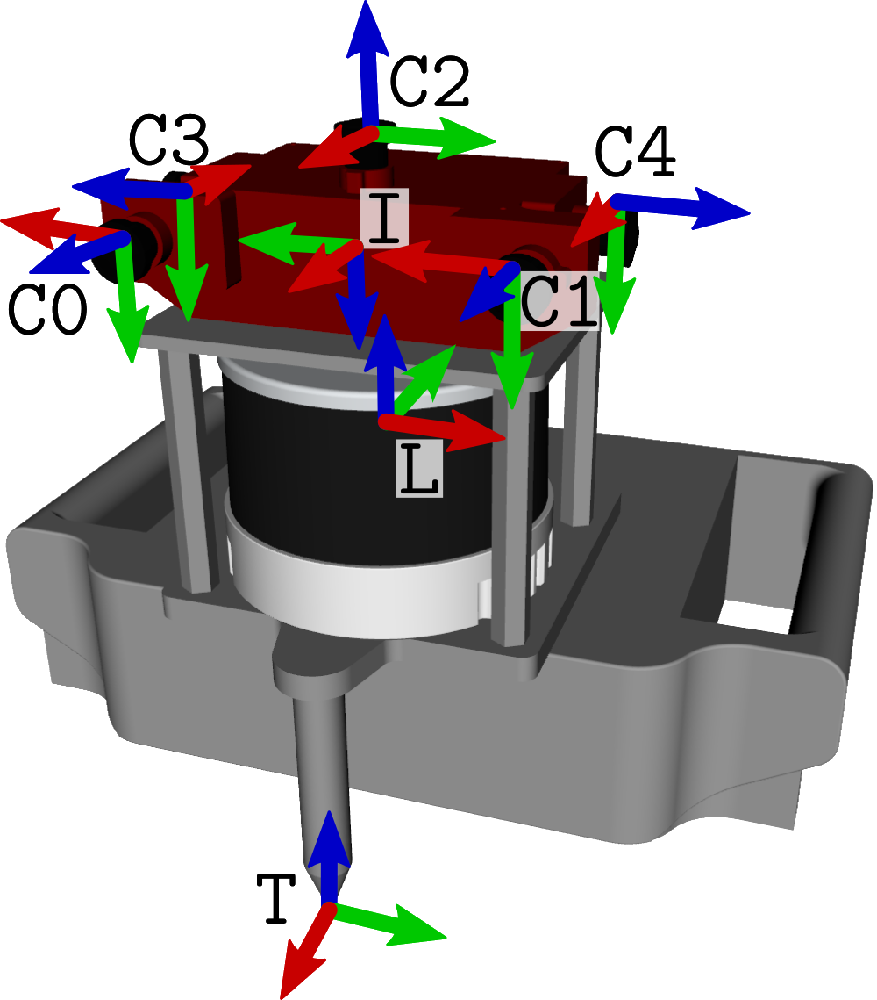

# Handheld Hardware
The handheld platform is the same as that of the 2022 SLAM Challenge.

## System Overview
It is equipped with a [Hesai Pandat XT-32](http://www.oxts.com/wp-content/uploads/2021/01/Hesai-PandarXT_User_Manual.pdf) LIDAR, and an [Alphasense Core](https://github.com/sevensense-robotics/alphasense_core_manual) camera+IMU. 
An overview of the coordinate systems can be seen in the following image



## Synchronization
The synchronization between the cameras is done by a FPGA. The cameras and the LIDAR are synchronized via PTP. All sensor clocks are aligned to within 1 ms.

## Calibration
We used [kalibr](https://github.com/ethz-asl/kalibr) for the intrinsic calibration of the cameras, [imu_utils](https://github.com/gaowenliang/imu_utils.git) for the intrinsic calibration of the IMU and [MultiCal](https://github.com/zhixy/multical) for the extrinsic calibration of IMU, cameras and LiDAR. A calibration (together with a dataset for running a new calibration) is made available on the [Challenge Website](https://hilti-challenge.com).

## Datasets
We provide datasets from two construction site locations. Each location can be considered a multisession group of sequences.
Site 1 contains 5x handheld datasets.
Site 2 introduces 3x robot datasets and 3x handheld datasets (TBD). Robot dataset information can be accessed on its own [documentation page](documentation/hardware/Robot.md). 

The handheld datasets are as follows.

| Dataset                  | Description                                                                                                |
|--------------------------|------------------------------------------------------------------------------------------------------------|
| site1_handheld_1.bag     | Floor 0 of site 1.                                                                                         |
| site1_handheld_2.bag     | Floor 1 of site 1.                                                                                         |
| site1_handheld_3.bag     | Floor 2 of site 1.                                                                                         |
| site1_handheld_4.bag     | Underground level at site 1.                                                                               |
| site1_handheld_5.bag     | A staircase dataset at site 1.                                                                             |

### Topics
#### /alphasense/imu
The IMU topic of type [`sensor_msgs/Imu`](http://docs.ros.org/en/noetic/api/sensor_msgs/html/msg/Imu.html) provides accelerometer and gyroscope measurements at a rate of 200Hz.

#### /hesai/pandar
The LiDAR topic of type [`sensor_msgs/PointCloud2`](http://docs.ros.org/en/melodic/api/sensor_msgs/html/msg/PointCloud2.html) provides the sensor readings of the hemispherical LiDAR mounted to the front of the system at 10Hz. The fields are as follows:

| Field     | Type         | Description                                                                            |
|-----------|--------------|----------------------------------------------------------------------------------------|
| x,y,z     | float32      | Measured point in Cartesian coordinates                                                |
| intensity | float32      | The intensity of the measurement, 0 to 254. We know that uint8 would have been smarter |
| timestamp | float64      | The timestamp of the point                                                             |
| ring      | uint8 array  | The index of the laser diode which captured the point, 0 to 31                         |

#### /alphasense/cam0/image_raw
The camera topics of type [`sensor_msgs/Image`](http://docs.ros.org/en/noetic/api/sensor_msgs/html/msg/Image.html) provide the image data for the sensors at 10Hz. The image dimensions are `720x540`. The `<DIRECTION>` refers to where the respective camera is oriented. The topics and frames are as follows:

| Direction | Topic                      | Frame ID           |
|-----------|----------------------------|--------------------|
| front     | /alphasense/cam0/image_raw | cam_0_sensor_frame |
| front     | /alphasense/cam1/image_raw | cam_1_sensor_frame |
| up        | /alphasense/cam2/image_raw | cam_2_sensor_frame |
| right     | /alphasense/cam3/image_raw | cam_3_sensor_frame |
| left      | /alphasense/cam4/image_raw | cam_4_sensor_frame |

## FAQ Handheld

### We noticed that the timestamp for every point in a lidar point cloud scan is equal. Is it possible to correct this issue?
The Hesai ros driver stores the timestamp in [this struct](https://github.com/HesaiTechnology/HesaiLidar_General_ROS/blob/master/src/HesaiLidar_General_SDK/src/PandarGeneralRaw/include/pandarGeneral/point_types.h). What happens is the `sensor_msgs/PointCloud2` Message has a "data" member in byte and it stores the `PointXYZIT` defined time, xyz, etc. The "field" member describes what type of info is in "data". In a programme, one would convert the `PointCloud2` msg into `PointXYZIT` msg to access all the element pandar records.

### Is there a URDF model of the sensor setup?
Yes there is. You can clone and compile the following ROS packages:
- [`phasma_description`](https://github.com/Hilti-Research/phasma_description.git): this is the main URDF model of the sensor setup.
- [`hesai_description`](https://github.com/Hilti-Research/hesai_description): this is the URDF model of the HESAI. It's a dependency of `phasma_description`.
- [`alphasense_description`](https://github.com/Hilti-Research/alphasense_description): this is the URDF of the Alphasense. It's a dependency of `phasma_description`.

To have them in you system you can just clone and compile them in your catkin workspace, for example:
```
cd ~/catkin_ws/src/
git clone https://github.com/Hilti-Research/phasma_description.git
git clone https://github.com/Hilti-Research/hesai_description.git
git clone https://github.com/Hilti-Research/alphasense_description.git
cd ..
catkin build phasma_description
```