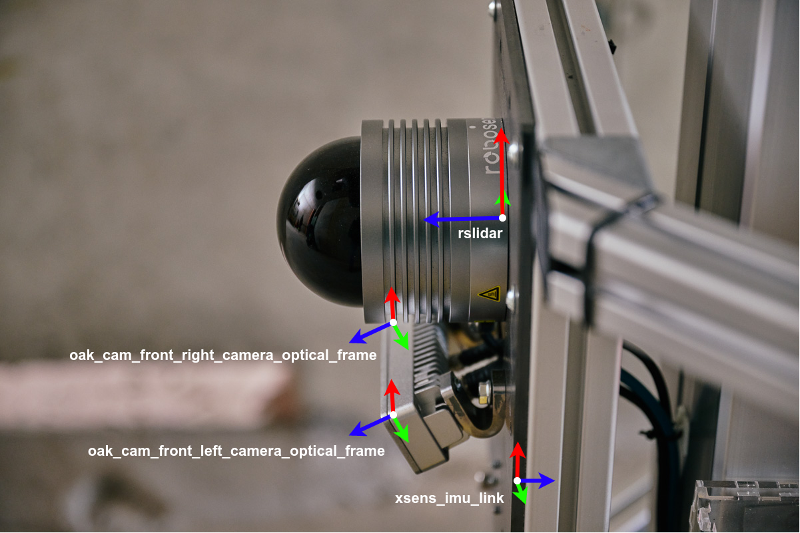
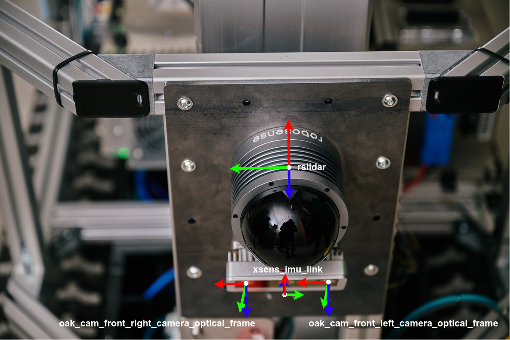
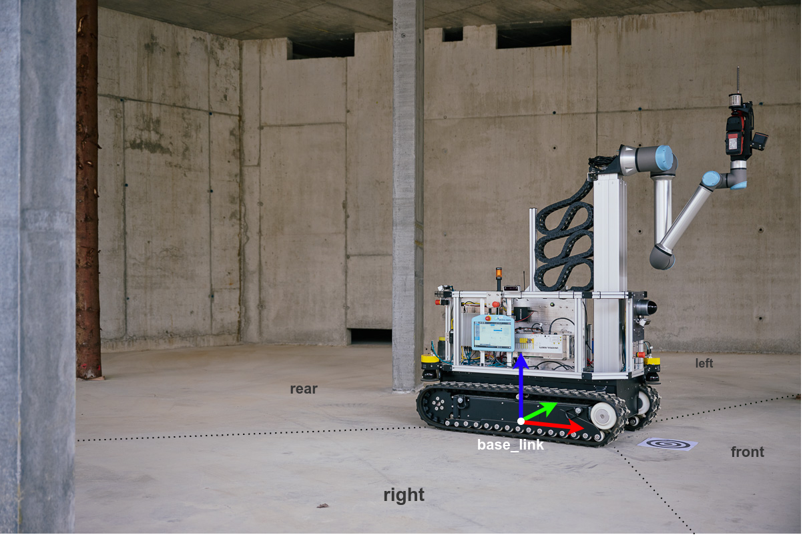

# Robot Hardware

In this year's SLAM challenge, for the first time, we provide a dataset which was recorded with a robot. In the following, you find an overview about the system.

## System Overview

The robot used to record the datasets is a minimalistic version of the [Hilti JaiBot](https://www.hilti.group/content/hilti/CP/XX/en/company/media-relations/media-releases/Jaibot.html). We have equipped the system with a [XSens MTi-600](https://www.xsens.com/hubfs/Downloads/Leaflets/MTi%20600-series%20Datasheet.pdf) IMU, a [Robosense Bpearl](https://www.robosense.ai/en/rslidar/RS-Bpearl) LiDAR and four [OAK-D Pro PoE](https://docs.luxonis.com/projects/hardware/en/latest/pages/NG9097prow.html) cameras. An overview of the coordinate systems can be seen in the following images:

## Synchronization

All sensors (except for track odometry) are hardware synchronized. A PTP master is running on the NIC of the main PC. The LiDAR sensor is synchronized directly to the master via PTP. The clock of the IMU is synchronized via a PTP-to-trigger conversion board. The same board also triggers the cameras start-of-exposure. All cameras **start** their exposure simultaneously, but every stereo camera pair runs its own auto-exposure algorithm. Each stereo camera pair uses the same exposure. The timestamp of the image messages corresponds to the center-of-exposure.

The clocks of the IMU and the LiDAR are expected to be synchronized within 1ms accuracy. The clocks of the IMU and the cameras are expected to be synchronized within 2ms accuracy.

## Calibration

We used [kalibr](https://github.com/ethz-asl/kalibr) for the intrinsic calibration of the cameras, [imu_utils](https://github.com/gaowenliang/imu_utils.git) for the intrinsic calibration of the IMU and [MultiCal](https://github.com/zhixy/multical) for the extrinsic calibration of IMU, cameras and LiDAR. A calibration (together with a dataset for running a new calibration) is made available on the [Challenge Website](https://hilti-challenge.com).

## Datasets

In total, we provide three robotic datasets which were recorded on a construction site of a parking garage.

| Dataset           | Description                                                                    |
|-------------------|--------------------------------------------------------------------------------|
| site2_robot_1.bag | A long dataset with the robot driving through all three parking garage levels. |
| site2_robot_2.bag | A dataset of a large room with the robot driving through the center.           |
| site2_robot_3.bag | A dataset of a (different) large room with the robot driving through the center at night.  |

### Topics
#### /imu/data
The IMU topic of type [`sensor_msgs/Imu`](http://docs.ros.org/en/noetic/api/sensor_msgs/html/msg/Imu.html) provides accelerometer and gyroscope measurements at a rate of 200Hz. The frame ID of the measurements is `xsens_imu_link`.

#### /rslidar_points
The LiDAR topic of type [`sensor_msgs/PointCloud2`](http://docs.ros.org/en/melodic/api/sensor_msgs/html/msg/PointCloud2.html) provides the sensor readings of the hemispherical LiDAR mounted to the front of the system at 10Hz. The header timestamp corresponds to the last (latest) point in the message. The fields are as follows

| Field     | Type    | Description                                                                            |
|-----------|---------|----------------------------------------------------------------------------------------|
| x,y,z     | float32 | Measured point in Cartesian coordinates                                                |
| intensity | float32 | The intensity of the measurement, 0 to 254. We know that uint8 would have been smarter |
| ring      | uint16  | The index of the laser diode which captured the point, 0 to 31                         |
| timestamp | float64 | The **absolute** timestamp of the point                                                |

Note that unlike the images might suggest, when recording the datasets, we removed the robot arm. Therefore, it is possible to use the full pointcloud without running a self-filter. The frame ID of the LiDAR measurements is `rslidar`.

#### /track_odometry
The track odometry topic of type [`nav_msgs/Odometry`](http://docs.ros.org/en/noetic/api/nav_msgs/html/msg/Odometry.html) provides a 2D estimate of the linear and angular velocity and an integrated 2D position of the system given the track velocities at 100Hz. Note that this sensor is only software-synchronized (we do not expect this to be significantly more accurate than 10ms). The frame ID of the odometry reference frame is `odom` and the child frame is `base_link`.

#### /oak_cam_<STEREO_DIRECTION>/\<SUB_CAMERA>/image_raw
The camera topics of type [`sensor_msgs/Image`](http://docs.ros.org/en/noetic/api/sensor_msgs/html/msg/Image.html) provide the image data for the sensors at 10Hz. The image dimensions are `1280x800`. The header timestamp corresponds to the center-of-exposure of the image. The `<STEREO_DIRECTION>` refers to where the stereo camera is pointing (front, left, rear, right) and the `<SUB_CAMERA>` selects the actual camera on the stereo camera system (left, right). The frames are named as follows

| Stereo Direction | Sub-camera | Topic                          | Frame ID                                 |
|------------------|------------|--------------------------------|------------------------------------------|
| front            | left       | /oak_cam_front/left/image_raw  | oak_cam_front_left_camera_optical_frame  |
|                  | right      | /oak_cam_front/right/image_raw | oak_cam_front_right_camera_optical_frame |
| left             | left       | /oak_cam_left/left/image_raw   | oak_cam_left_left_camera_optical_frame   |
|                  | right      | /oak_cam_left/right/image_raw  | oak_cam_left_right_camera_optical_frame  |
| rear             | left       | /oak_cam_rear/left/image_raw   | oak_cam_rear_left_camera_optical_frame   |
|                  | right      | /oak_cam_rear/right/image_raw  | oak_cam_rear_right_camera_optical_frame  |
| right            | left       | /oak_cam_right/left/image_raw  | oak_cam_right_left_camera_optical_frame  |
|                  | right      | /oak_cam_right/right/image_raw | oak_cam_right_right_camera_optical_frame |

#### /oak_cam_<STEREO_DIRECTION>/\<SUB_CAMERA>/exposure_info
The exposure info topics of type [`hilti_slam_challenge_msgs/ExposureInfo`](https://github.com/Hilti-Research/hilti_slam_challenge_msgs/blob/main/msg/ExposureInfo.msg) provide additional information for the images. The header of these messages is equivalent to the corresponding image message. The message contains the fields `start_of_frame` corresponding to the **absolute** start of exposure (this is synchronized across all cameras), the `exposure_time` corresponding to the exposure time in microseconds, and the `iso` corresponding to the sensor sensitivity reported by the camera auto-exposure algorithm.

## FAQ Robot
### Is there a URDF model of the sensor setup?
Absolutely, see [`trailblazer_description`](https://github.com/Hilti-Research/trailblazer_description).
